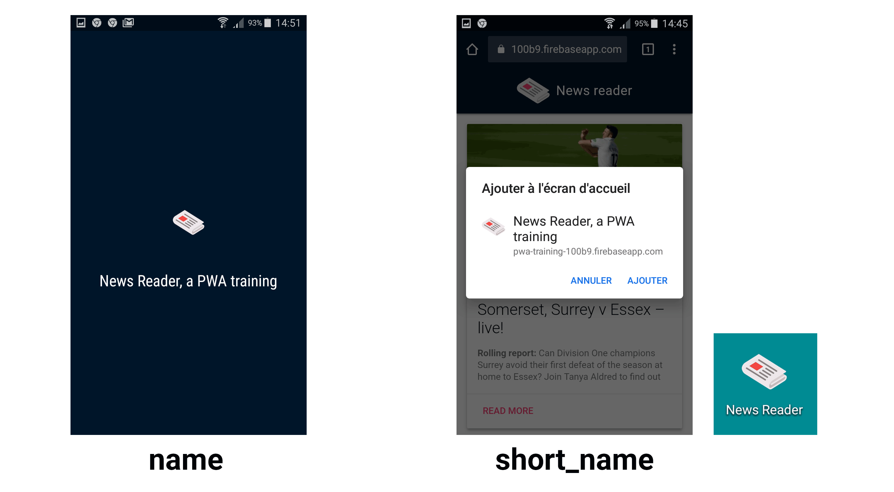

<!-- .slide: class="title logo" data-background="#b5b42c" -->

# Progressive Web Apps :
# Où en sommes-nous aujourd'hui ?

### Alexandra Janin

---

<!-- .slide: class="alternate" -->

## Sommaire

* Principe des PWA

* Apps hybrides / natives / web

* Compatibilité et limitations

* Icône et splash screen

* Service Worker

* Stockage des données

* Workbox

* Notifications push

---

<!-- .slide: class="title bg-rocks" -->

# Présentation générale

<!--v-->

## Une application accessible par navigateur


<!--v-->

## Disponible hors ligne


<!--v-->

# Principe des PWA

* Site répondant aux **standards du web**

* Accessible depuis un navigateur

* Amélioration progressive

* Mais qui **répond à certains critères**...

(PWA **n'est PAS** estampillé Google. Même si les Google Developers contribuent beaucoup à la documentation sur le sujet.)

Note: Terme marketing "inventé" pour promouvoir une façon de concevoir des sites web

<!--v-->

## Doit répondre à ces critères

* **Performance** : fonctionnelle quelque soit la performance de l'appareil ou du réseau.

* **Disponibilité** : doit toujours être accessible, indépendamment de l'appareil ou de la qualité du réseau.

* **Expérience similaire aux applications natives** :
    * Mode plein écran
    * Possibilité de l'installer
    * Push notifications

<!--v-->

## Comment savoir si mon app est une PWA ?


[**Lighthouse**](https://developers.google.com/web/tools/lighthouse/#devtools) est un outil disponible dans les devtools de Chrome dans l'onglet **Audit**. Lighthouse permet de mesurer :

* Performance
* Accessibilité
* Bonnes pratiques
* SEO


<!--v-->

# Comparatif

#### Applications natives

* Développement spécifique Android (Java) / iOS (Swift)
* JS compilé en natif : React Native, Native Script

#### Applications hybrides

* Navigateur web "encapsulé" : Ionic, Cordova

#### Applications web

* Progressive Web App


<!--v-->

## Les avantages des PWA

* Comportement similaire à une app native 

* Sans les contraintes des apps mobiles (soumission aux stores, coût en stockage / mémoire)

* Coûts de développement moindres (pas de développements spécifiques à chaque plateforme)


## Les inconvénients des PWA

* Encore mal supporté par Safari

* Pas le plus adapté pour les applications lourdes (cartographie, audio,...)


<!--v-->

# Compatibilité et limitations des PWA


[Is Service Worker Ready ?](https://jakearchibald.github.io/isserviceworkerready/)

Test si le navigateur supporte les SW :

```javascript
if ('serviceWorker' in navigator) {
  ...
}
```

Note: Aujourd'hui, les services workers sont compatibles avec, **Chrome**, **Firefox**, **Safari** à partir de la version 11 de iOS.

<!--v-->

## Principe de l'amélioration progressive

* Doit fonctionner si le navigateur ne supporte pas les SW.

* Ne jamais faire en sorte qu'une requête ne fonctionne que si un SW est présent.

* Une PWA, c'est un **confort en plus pour l'utilisateur**

---

<!-- .slide: class="title bg-rocks" -->

# Icône et splash screen

## `manifest.json`

<!--v-->

# Rôle du `manifest.json`

Le fichier `manifest.json` permet la personnalisation des éléments suivant : 

* L'**icône de l'application**

* Le **nom de l'application**

* Le style du **splash screen**

* Le **type d'affichage** (plein écran, orientation, couleur du bandeau android,…)

Il est déclaré via le html

```html
<link rel="manifest" href="/manifest.json">
```

<!--v-->

Le fichier **`manifest.json`** ressemble généralement à ceci :

```json
{
    "name": "News Reader, a PWA training",
    "short_name": "News Reader",
    "start_url": "/",
    "icons": [
        {
            "src": "/android-chrome-192x192.png",
            "sizes": "192x192",
            "type": "image/png"
        },
        {
            "src": "/android-chrome-512x512.png",
            "sizes": "512x512",
            "type": "image/png"
        }
    ],
    "theme_color": "#ffffff",
    "background_color": "#ffffff",
    "display": "standalone",
    "related_applications": [{
        "platform": "play",
        "url": "https://play.google.com/store/apps/details?id=cheeaun.hackerweb"
    }]
}
```

[Référence du Web App Manifest [en]](https://developer.mozilla.org/en-US/docs/Web/Manifest), MDN

<!--v-->

## Définir le nom et le point d'entrée de l'application



* `start_url` : point d'entrée de l'application

<!--v-->

### Définir la couleur principale : `theme_color`

Détecté automatiquement par Chrome, personnalisable.


<!--v-->

## Définir le type d'affichage

* `"display": "browser"` (à gauche)
* `"display": "standalone"` (à droite)


<!--v-->

## Vérifier le `manifest.json`

On peut vérifier le manifest et les icônes en allant dans l'onglet **Application > Manifest**.


<!--v-->

## Bandeau d'installation de l'app

Le **bandeau d'installation de l'app** s'affiche automatiquement si [tous les critères sont bien remplis](https://developers.google.com/web/fundamentals/app-install-banners/).


---

<!-- .slide: class="title bg-rocks" -->

# Service Worker

<!--v-->

# Principe du Service Worker

## Aident à répondre au critère de disponibilité

3 concepts à retenir :

* **Thread en arrière-plan** (car c'est le principe d'un Worker)

* **Rôle de proxy**

* **Communication avec le Javascript du site**

Ils fonctionnent uniquement sur HTTPS pour des raisons de sécurité.

Note: 
* Thread en arrière-plan => notification et mise en cache en arrière plan.
* Proxy => intercepte les requêtes émises et contrôle les réponse

<!--v-->

## Les outils

* [**Service Worker Precache**](https://github.com/GoogleChromeLabs/sw-precache)

* [**Service Worker Toolbox**](https://github.com/GoogleChromeLabs/sw-toolbox)

* [**Workbox**](https://developers.google.com/web/tools/workbox/)

Les framework (React, Vue, Angular,...) disposent en général déjà de Workbox ou d'une implémentation pour gérer les SW.

<!--v-->

## Déclaration du Service Worker avec `register`

```javascript
// index.js

if ('serviceWorker' in navigator) {
    navigator.serviceWorker
        .register('/sw-test/service-worker.js', {
            scope: '/sw-test/'
        })
        .then(registration => {
            // Le Service Worker est déclaré !
            console.log('Registration OK');
        })
        .catch(error => {
            // Il y a eu un problème
            console.error('Erreur: ', error);
        });
}
```

```javascript
// service-worker.js

console.log('SW: OK');
```

Note: Le SW s'exécute en tâche de fond et doit avoir un **fichier JS dédié**. Besoin d'un **script sur notre site qui va initialiser le Service Worker**.

<!--v-->

# Le cycle de vie d'un Service Worker

* Le SW s'active à la première consultation du site.
* Il restera en tâche de fond (idle) tant qu'il ne sera pas mis à jour


<!--v-->

# Le cycle de vie d'un Service Worker


<!--v-->

## Inspecter les Services Workers

Dans Chrome, **onglet Application**, on peut visualiser l'état des Service Worker. 


<!--v-->

## Écouter les événements du cycle de vie

```javascript
// service-worker.js

self.addEventListener('install', function (event) {
    // SW en cours d'installation
    event.waitUntil(
        // Ici on va pouvoir mettre en cache des données
        // On devra retourner une promesse
    );
});

self.addEventListener('activate', function (event) {
    // En général, on se sert de cet événement pour
    // supprimer les anciennes versions du cache
});
```

<!--v-->

## Intercepter les requêtes avec `fetch`

Exemple : le SW intercepte toutes les requêtes et renvoie à la place une nouvelle réponse grâce à **`respondWith()`**.

```javascript
// service-worker.js

self.addEventListener("fetch", event => {
    event.respondWith(new Response('Bonjour'))
});
```

<!--v-->

**`event.respondWith()`** peut prendre en paramètre :

* Un objet [**Response**](https://developer.mozilla.org/fr/docs/Web/API/Response)

```javascript
event.respondWith(new Response(
    '<p>Hello <strong>World</strong></p>',
    headers: {'Content-Type': 'text/html'}
));
```

* Un élément du cache

```javascript
event.respondWith(
    caches.match(event.request);
);
```

* Une promise **`fetch()`**

```javascript
event.respondWith(
    fetch('images/404.png');
);
```

<!--v-->

## Communiquer avec le JS du site avec `message`

```javascript
// index.js

function sendMessage(message) {
    // navigator.serviceWorker.controller est égal à l'objet du SW actif
    // ou null, s'il n'y en a pas
    if (navigator.serviceWorker.controller) {
        navigator.serviceWorker.controller.postMessage('Bonjour');
    }
}
```

```javascript
// service-worker.js

self.addEventListener("message", event => {
    // Ici on récupère les messages émis par le JS du site
    console.log("Message reçu : " + event.data);
});
```

---

<!-- .slide: class="title bg-rocks" -->

# Stockage des données

<!--v-->

# Les APIs de stockage navigateur


## Recommendations :

* **Cache API** pour les assets
* **IndexedDB** pour les données et state de l'application 

<!--v-->

## Espace disponible


* Espace total par domaine, toutes API confondues

* [Quota Management API](https://developer.mozilla.org/en-US/docs/Web/API/StorageQuota) (sur Chrome uniquement)

<!--v-->

# Utilisation de la Cache API

* L'[**interface Cache**](https://developer.mozilla.org/fr/docs/Web/API/Cache) permet de **stocker les réponses des requêtes effectuées par notre application**. 

* **disponible sur l'objet `window`** et via le SW

Le point d'entrée est **`caches`**.

```javascript
caches.open('mysite-static-v3').then(function (cache) {
    // Ici on peut ajouter ou supprimer des éléments à cache
}
```
   
<!--v-->

# Stratégies de cache

On retiendra principalement :

* **Cache First**

* **Network First**

* **Stale While Revalidate** : on récupère d'abord le cache. Ensuite on fait la requête sur le réseau et on met en cache la réponse pour la prochaine fois.

cf. [The Offline Cookbook](https://developers.google.com/web/fundamentals/instant-and-offline/offline-cookbook/)

<!--v-->

## Cache first

Pour du offline-first


<!--v-->

## Cache first

```javascript
// service-worker.js

self.addEventListener('fetch', function (event) {
    event.respondWith(
        // On demande au cache si il existe une entrée correspondant à la requête
        caches.match(event.request).then(function (response) {
            // Si oui, on renvoie les données du cache
            // Si non, on fetch la requête via le réseau
            return response || fetch(event.request);
        })
    );
});
```

<!--v-->

## Network first

Pour ce qui doit être mis à jour très fréquemment : **articles, timeline de réseau social, avatar…**


<!--v-->

## Network first

```javascript
// service-worker.js

self.addEventListener('fetch', function (event) {
    event.respondWith(
        // On fait une requête réseau
        fetch(event.request).catch(function () {
            // Si elle échoue, on cherche la ressource en cache
            caches.match(event.request).then(function (response) {
                // Si elle existe, on renvoie les données du cache
                // Si non, on retourne un message
                return response || new Response('Ressource non disponible');
            })
        })
    );
});
```

<!--v-->

# Conclusion

Pour répondre aux critères de **disponibilité** (offline) et de **performance** :

### Service Worker

* Intercepte des évenements
* Pilote la mise en cache et la restitution des données

### Stockage des données

* **Cache API** pour les assets
* **IndexedDB** pour les données (state, data),...
* Limité en taille

---

<!-- .slide: class="title bg-rocks" -->

# Workbox

<!--v-->

# Workbox

[Workbox](https://developers.google.com/web/tools/workbox/) est une librairie qui facilite la conception d'applications hors ligne :

* Precaching
* Stratégies de cache
* Versionning de cache 
* Génération automatique de la liste des ressources
* Background Sync

<!--v-->

## Workbox config

```js
module.exports = {
  globDirectory: "public/",
  globPatterns: [
    "**/*.{js,png,xml,ico,svg,html,json,css}",
  ],
  swDest: "public/service-worker.js",
  runtimeCaching: [{
    urlPattern: new RegExp('^https://media\.guim\.co\.uk/'),
    handler: 'staleWhileRevalidate'
  },
  {
    urlPattern: new RegExp('^https://content\.guardianapis\.com/'),
    handler: 'staleWhileRevalidate'
  }]
};
```

---

<!-- .slide: class="title bg-rocks" -->

# Notifications push

<!--v-->

# Mise en place de Push Notification


<!--v-->

# Définitions

### Push API

Permet au service worker de recevoir des messages reçus du push service

### Notification API

Message visible par l'utilisateur (piloté par le SW) 


<!--v-->

### Service de messagerie (push service)

Transmet la notification au Service Worker

* [Firebase Cloud Messaging](https://firebase.google.com/docs/cloud-messaging/) (FCM, anciennement GCM) pour Chrome
* [Autopush](https://github.com/mozilla-services/autopush) pour Firefox
* [Microsoft Notification Hub](https://msdn.microsoft.com/en-us/library/azure/jj891130.aspx) pour Windows Mobile
* [Apple Push Notification service](https://developer.apple.com/library/content/documentation/NetworkingInternet/Conceptual/RemoteNotificationsPG/APNSOverview.html) (APNs) pour Safari


<!--v-->

## UX : demande de permission

* Expliquer en quoi les notifications seront utiles à l'utilisateur
* Moins intrusif


<!--v-->

## Serveur d'application (push provider)

Le serveur d'application sert à **piloter l'envoi de message push**.

* [Librairie Node.js Web Push](https://github.com/web-push-libs/web-push)
* [PyFCM](http://olucurious.github.io/PyFCM/)
* [Pusher Server API](https://pusher.com/docs/server_api_guide)

<!--v-->

## Envoi d'un message push avec PyFCM

```python
from pyfcm import FCMNotification

push_service = FCMNotification(api_key="<api-key>")

registration_id = "<device registration_id>"
message_title = "Uber update"
message_body = "Hi john, your customized news for today is ready"
result = push_service.notify_single_device(
    registration_id=registration_id,
    message_title=message_title,
    message_body=message_body
)

print result
```

<!--v-->

## VAPID

* Voluntary Application Server Identification for Web Push (**application server key**)
* Clé unique permettant de chiffrer les messages qui transitent à travers le push service.


Note: VAPID est une spec de la Push API.

<!--v-->


<!--v-->

## Services de push et de notification "tout-en-un"

| Services        |     | Limitations  |
| ------------- | ------------- | ----- |
| [One Signal](https://onesignal.com/)      | Très complet, intégrations CMS, planification, A/B&nbsp;tests, segmentation | Gratuit, illimité |
| [Pushcrew](https://pushcrew.com/) | Simple à utiliser, segmentation, ne supporte pas Safari | Gratuit jusqu'à 2000&nbsp;abonnés |
| [Pusher](https://pusher.com)     | Abstraction de la Push API et intégration d'APNs (Safari), envoi des messages via une CLI ou intégration à un serveur | Gratuit jusqu'à 100&nbsp;abonnés
| [Pushpad](https://pushpad.xyz/) | Abstraction de la Push API et intégration d'APNs (Safari) | À partir de 5$/mois

<!--v-->

# Exemple OneSignal


<!--v-->

## Envoi de messages Push avec OneSignal

Paramétrer l'envoi de messages push


---

# Conclusion

Doit-ont utiliser les PWA aujourdh'ui ?

## Pour

* Tout type d'applications : amélioration progressive
* Proposer une alternative légère (qui ne nécessite pas d'installation) à des applications natives
* Peu couteux à mettre en place

## Contre

* Si votre cible principale est iOS ou IE
* Pour les applications lourdes (cartographie, audio,...)

<!--v-->

# Pour aller plus loin

## TP

https://github.com/makinacorpus/pwa-training


---

# Ressources

## Articles en français

* [Découvrir le Service Worker](https://makina-corpus.com/blog/metier/2016/decouvrir-le-service-worker), Makina Corpus
* [Série d'articles de sur les PWA](https://www.julienpradet.fr/fiches-techniques/pwa-rendre-un-site-web-disponible-grace-aux-services-workers/), Julien Pradet
* [Application web progressives](https://developer.mozilla.org/fr/Apps/Progressive), MDN

## Pour en savoir plus sur le Service Worker

* [Cours interactif gratuit [en]](https://eu.udacity.com/course/offline-web-applications--ud899), Jake Archibald
* [Introduction aux Web Workers](https://www.synbioz.com/blog/introduction_aux_web_workers), Synbioz
* [Service Worker Cookbook [en]](https://serviceworke.rs/), MDN
* [Service Worker API](https://developer.mozilla.org/fr/docs/Web/API/Service_Worker_API), MDN
* [We built a PWA from scratch - This is what we learned [en]](https://14islands.com/blog/2017/01/19/progressive-web-app-from-scratch/), 14islands


<!--v-->

# Ressources

## Push Notification

* [Push Notification et VAPID](https://manu.ninja/web-push-notifications/)
* [Why Doesn’t Push Work when the Browser is Closed?](https://web-push-book.gauntface.com/chapter-07/01-faq/)
* [Using Web Push Notifications with VAPID](https://rossta.net/blog/using-the-web-push-api-with-vapid.html)

## Background Sync

* [A Basic Guide to BackgroundSync](https://ponyfoo.com/articles/backgroundsync)

---

<!-- .slide: class="title bg-rocks" -->

# Des questions ?