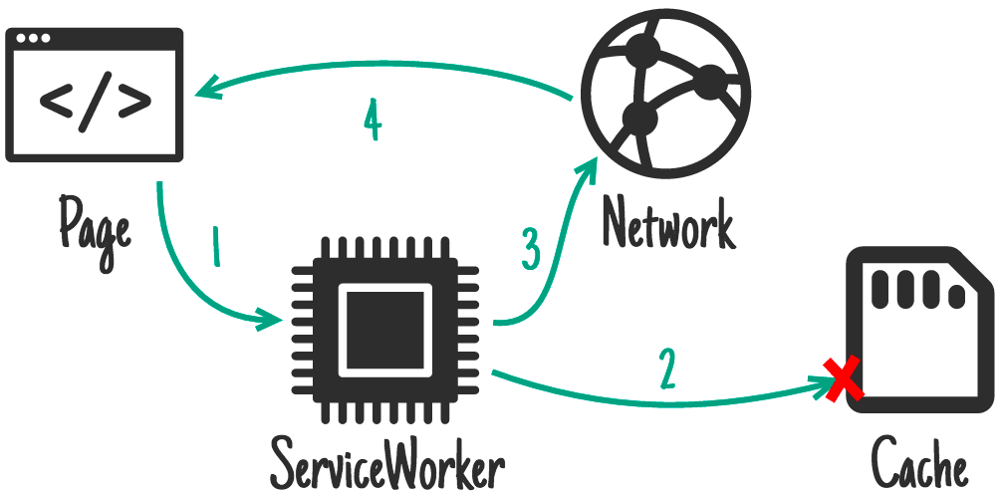
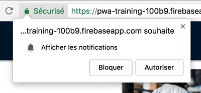

<!-- .slide: class="title logo" data-background="#b5b42c" -->

# Progressive Web Apps :
# Où en sommes-nous aujourd'hui ?

### Alexandra Janin

---

<!-- .slide: class="programme bg-lion-left" -->

# Sommaire

* Principe des PWA
* Comparatif apps hybrides / natives / web
* Compatibilité et limitations des PWA
* Icône et splash screen
* Service Worker
    * Définition
    * Mise en place / Cycle de vie
* Gestion du cache
    * Différents modes de stockage des données
    * Les stratégies de cache
* Workbox
* Notifications push
    * Concept / architecture
    * Les services de notification push

---

<!-- .slide: class="title bg-rocks" -->

# Présentation générale

<!--v-->

# Principe des PWA

* Terme marketing "inventé" pour promouvoir une façon de concevoir des sites web
* Site web répondant aux **standards du web**
* Accessible depuis un navigateur
* Mais qui **répond à certains critères**...

(PWA **n'est PAS** estampillé Google. Même si les Google Developers contribuent beaucoup à la documentation sur le sujet.)

<!--v-->

## Doit répondre à ces critères

* **Performance** : fonctionnelle quelque soit la performance de l'appareil ou du réseau.
* **Disponibilité** : doit toujours être accessible, indépendamment de l'appareil ou de la qualité du réseau.
* **Expérience similaire aux applications natives** :
    * Mode plein écran
    * Possibilité de l'installer
    * Push notifications

<!--v-->

# Comment savoir si mon app est une PWA ?

## Lighthouse


[**Lighthouse**](https://developers.google.com/web/tools/lighthouse/#devtools) est un outil open source pour Chrome, développé par Google. Il est disponible dans les devtools de Chrome, dans l'onglet **audit** ou via l'extension. Lighthouse permet de mesurer :

* Performance
* Progressive Web App
* Accessibilité
* Bonnes pratiques
* SEO (uniquement via l'extension)


<!--v-->

# Comparatif apps hybrides / natives / web

## Applications natives

* Développement spécifique Android (Java) / iOS (Swift)
* JS compilé en natif : React Native, Native Script

## Applications hybrides

* Navigateur web "encapsulé" : Ionic, Cordova

## Applications web

* Progressive Web App


<!--v-->

# Comparatif apps hybrides / natives / web

## Les avantages des PWA

* Comportement similaire à une app native 
    * Sans les contraintes des apps mobiles (soumission aux stores
    , coût en stockage / mémoire)
    * Coûts de développement moindres (pas de développements spécifiques à chaque plateforme)

<!--v-->

# Compatibilité et limitations des PWA


Aujourd'hui, les services workers sont compatibles avec, **Chrome**, **Firefox**, **Safari** à partir de la version 11 de iOS.

[Is Service Worker Ready ?](https://jakearchibald.github.io/isserviceworkerready/)

On peut tester si le navigateur supporte les SW grâce à la condition suivante :

```javascript
if ('serviceWorker' in navigator) {
  ...
}
```

<!--v-->

## Principe de l'amélioration progressive

Dans le web, on entend souvent parler d'**amélioration progressive** ou de **dégradation gracieuse**.

Une PWA, c'est de l'amélioration progressive :

- L'application **doit** fonctionner si le navigateur ne supporte pas les Services Workers.
- Ne jamais faire en sorte qu'une requête ne fonctionne uniquement si un Service Worker est présent.
- Une PWA, c'est un **confort en plus pour l'utilisateur**, ça ne doit pas pénaliser ceux qui ne pourraient pas en profiter.

---

<!-- .slide: class="title bg-rocks" -->

# Icône et splash screen

## Configuration du `manifest.json`

<!--v-->

# Configurer le Manifest de l'application

Pour que notre application se comporte comme une véritable app mobile, nous allons devoir configurer :
* L'**icône de l'application**
* Le **nom de l'application** (qui s'affichera sous l'icône)
* Le style du **splash screen** (l'écran qui s'affiche au chargement de l'app)
* L'affichage d'un **bandeau qui propose l'installation** de l'app
* Le **type d'affichage** (plein écran, orientation, couleur du bandeau android,…)

C'est le rôle du fichier `manifest.json`, qui sera appelé via le html :

```html
<link rel="manifest" href="/manifest.json">
```

<!--v-->

Le fichier **`manifest.json`** ressemble généralement à ceci :

```json
{
    "name": "News Reader, a PWA training",
    "short_name": "News Reader",
    "start_url": "/",
    "icons": [
        {
            "src": "/android-chrome-192x192.png",
            "sizes": "192x192",
            "type": "image/png"
        },
        {
            "src": "/android-chrome-512x512.png",
            "sizes": "512x512",
            "type": "image/png"
        }
    ],
    "theme_color": "#ffffff",
    "background_color": "#ffffff",
    "display": "standalone",
    "related_applications": [{
        "platform": "play",
        "url": "https://play.google.com/store/apps/details?id=cheeaun.hackerweb"
    }]
}
```

[Référence du Web App Manifest [en]](https://developer.mozilla.org/en-US/docs/Web/Manifest), MDN

<!--v-->

## Définir le nom et le point d'entrée de l'application

* `name` : le nom de l'application qui sera affiché sur le splash screen
* `short_name` : le nom de qui sera affiché sous l'icône
* `start_url` : définit la page principale sur laquelle l'utilisateur arrivera


<!--v-->

## Définir le style de l'application

* `background_color` : la couleur de fond du splash screen
* `theme_color` : la couleur qui sera utilisée pour la barre (exemple ci-dessous)


<!--v-->

## Définir le type d'affichage

* `"display": "browser"` (à gauche)
* `"display": "standalone"` (à droite)


<!--v-->

## Vérifier le `manifest.json`

On peut vérifier le manifest et les icônes en allant dans l'onglet : **Application > Manifest**.


<!--v-->

# Bandeau d'installation de l'app

Une fois l'app manifest déclaré, si [tous les critères sont bien remplis](https://developers.google.com/web/fundamentals/app-install-banners/), le **bandeau d'installation de l'app** (ou **app install banner**) devrait s'afficher automatiquement.


---

<!-- .slide: class="title bg-rocks" -->

# Les Service Worker

## Définition

<!--v-->

# Principe du Service Worker

Apparus avant les PWA, les Services Workers aident à répondre au critère de **disponibilité**.

3 concepts à retenir :
* **Thread en arrière-plan** (car c'est le principe d'un Worker)
* **Rôle de proxy**
* **Communication avec le Javascript du site**

Ils fonctionnent uniquement sur HTTPS pour des raisons de sécurité.

Note: Un Service Worker est un [Web Worker](https://developer.mozilla.org/fr/docs/Web/API/Web_Workers_API). Il prend la forme d'un fichier Javascript qui peut contrôler le site auquel il est associé.

<!--v-->

# Principe du Service Worker

## Thread en arrière-plan

C'est un **code qui va tourner sur le navigateur à côté du site** (dans un thread en arrière plan d'un contenu web)
* Reste actif même si on quitte le site
    * **Notifications**
    * **Mise en cache en arrière plan**
* Possible de déplacer certaines tâches dans un Worker pour alléger la charge de travail du JS du site (qui s'exécute au même endroit que l'UI)
    * **Gain de performance**

Note: Les workers **s'exécutent dans un contexte différent de `window`**, ils n'ont donc pas accès au DOM, mais ont accès à la plupart des web API.

<!--v-->

# Principe du Service Worker

## Rôle de proxy

* Un Service Worker peut **intercepter les requêtes émises par le site**
    * On contrôle chaque requête et on peut ainsi modifier les réponses et le cache.
    * C'est cette fonctionnalité qui va permettre de rendre le site disponible hors ligne

<!--v-->

# Principe du Service Worker

## Communication avec le Javascript du site

* Il va pouvoir **communiquer avec les scripts du site** via l'[API postMessage](https://developer.mozilla.org/en-US/docs/Web/API/Client/postMessage)
* C'est un complément important à l'interception des requêtes lorsqu'on souhaite faire un site accessible hors ligne.


---

<!-- .slide: class="title bg-rocks" -->

# Service Worker

## Mise en pratique

<!--v-->

## Vous n'aurez probablement pas à "écrire" de Service Worker

Des outils existent pour simplifier la mise en place des Services Workers :

* [**Service Worker Precache**](https://github.com/GoogleChromeLabs/sw-precache)
* [**Service Worker Toolbox**](https://github.com/GoogleChromeLabs/sw-toolbox)
* [**Workbox**](https://developers.google.com/web/tools/workbox/)

Si vous utilisez un framework (React, Vue, Angular,...) il y a de fortes chances que l'un de ces outils soit déjà configuré, vous n'aurez pas grand chose à faire.

Sinon, il est aussi possible de tout "faire à la main", c'est ce que nous allons faire pour comprendre comment fonctionne le Service Worker.

<!--v-->

## Déclaration du Service Worker avec `register`

```javascript
// index.js

if ('serviceWorker' in navigator) {
    navigator.serviceWorker
        .register('/sw-test/service-worker.js', {
            scope: '/sw-test/'
        })
        .then(registration => {
            // Le Service Worker est déclaré !
            console.log('Registration OK');
        })
        .catch(error => {
            // Il y a eu un problème
            console.error('Erreur: ', error);
        });
}
```

```javascript
// service-worker.js

console.log('SW: OK');
```

l'option `{ scope: '/sw-test/' }` sert à restreindre le contexte du SW à un dossier uniquement. Le SW sera actif pour l'ensemble du contenu du dossier `sw-test`

Note: Le SW s'exécute en tâche de fond et doit avoir un **fichier JS dédié**. Besoin d'un **script sur notre site qui va initialiser le Service Worker**.

<!--v-->

# Le cycle de vie d'un Service Worker


<!--v-->

# Le cycle de vie d'un Service Worker

* Le SW s'active à la première consultation du site.
* Il restera en tâche de fond (idle) tant qu'il ne sera pas mis à jour


<!--v-->

## Inspecter les Services Workers

Dans Chrome, **onglet Application**, on peut visualiser l'état des Service Worker. 

Pendant le développement il peut être intéressant de demander au Service Worker de se mettre à jour au reload de la page.


<!--v-->

## `install` et `activate`

Pour savoir où en est notre SW, il est possible d'écouter les événements :

* **`install`** : sert à **mettre en cache des fichiers**
* **`activate`** : sert à **supprimer les anciennes versions de cache**

```javascript
// service-worker.js

self.addEventListener('install', function (event) {
    // SW en cours d'installation
    event.waitUntil(
        // Ici on va pouvoir mettre en cache des données
        // On devra retourner une promesse
    );
});

self.addEventListener('activate', function (event) {
    // En général, on se sert de cet événement pour
    // supprimer les anciennes versions du cache
});
```

<!--v-->

# Intercepter les requêtes avec `fetch`

**Après la phase d'activation**, le Service Worker est prêt à intercepter les événements **`fetch`** émis par une **requête serveur**.

L'objet **`event`** va permettre de manipuler les requêtes notamment grâce à :
* `event.respondWith`
* `event.request`

Exemple : ici le SW intercepte toutes les requêtes et renvoie à la place une nouvelle réponse grâce à **`respondWith()`**.

```javascript
// service-worker.js

self.addEventListener("fetch", event => {
    event.respondWith(new Response('Bonjour'))
});
```

<!--v-->

## Récupérer les infos grâce à Request

**Via `event`, on a accès à l'objet `request`**. On peut ainsi accéder aux infos concernant la requête qui vient d'être interceptée grâce à [Request](https://developer.mozilla.org/fr/docs/Web/API/Request).

```javascript
// service-worker.js

self.addEventListener("fetch", event => {
    console.log(event.request)
});
```

* **request.url**
* **request.header**
* ...

Même exemple, mais en interceptant uniquement les requêtes vers `/bonjour`

```javascript
// service-worker.js

self.addEventListener("fetch", event => {
    if (event.request.url === "/bonjour") {
        event.respondWith(new Response('Bonjour'))
    }
});
```


<!--v-->

**`event.respondWith()`** peut prendre en paramètre :

* Un objet [**Response**](https://developer.mozilla.org/fr/docs/Web/API/Response)

```javascript
event.respondWith(new Response(
    '<p>Hello <strong>World</strong></p>',
    headers: {'Content-Type': 'text/html'}
));
```

* Un élément du cache

```javascript
event.respondWith(
    caches.match(event.request);
);
```

* Une promise **`fetch()`**

```javascript
event.respondWith(
    fetch('images/404.png');
);
```

<!--v-->

## Faire une requête sur un domaine différent (CORS)

Si le serveur ne supporte pas le cross-origin, il est possible d'utiliser le mode `no-cors`

```javascript
event.respondWith(
    fetch('https://bar.com/data.json', { 
        mode: 'no-cors' // 'cors' par défaut
    });
);
```

<!--v-->

## Méthodes HEAD et GET

La méthode HEAD est utile pour recevoir uniquement les métadonnées d'une requête :

```javascript
event.respondWith(
    fetch('example/video.mp4', { 
        method: 'HEAD'
    });
);
```

Il est aussi possible d'envoyer des POST, par exemple si la connexion a été perdue, on peut renvoyer un formulaire qui a été stocké auparavant :

```javascript
event.respondWith(
    fetch('example/comment', { 
        method: 'POST',
        body: 'title=hello&message=world'
    });
);
```

<!--v-->

# Communiquer avec le JS du site avec `message`

Après la phase d'activation, le Service Worker est prêt à intercepter l'événement **`message`** émis par un appel via l'API postMessage.

```javascript
// index.js

function sendMessage(message) {
    // navigator.serviceWorker.controller est égal à l'objet du SW actif
    // ou null, s'il n'y en a pas
    if (navigator.serviceWorker.controller) {
        navigator.serviceWorker.controller.postMessage('Bonjour');
    }
}
```

```javascript
// service-worker.js

self.addEventListener("message", event => {
    // Ici on récupère les messages émis par le JS du site
    console.log("Message reçu : " + event.data);
});
```

<!--v-->

# Afficher une notification lors d'un `push`

Après la phase d'activation, le Service Worker est prêt à intercepter l'événement **`push`** émis par le service de push du navigateur.

On pourra alors, selon le scénario choisi :
* mettre en cache des éléments à précharger
* afficher une notification

*Exemple : application Twitter, chargement du tweet, puis affichage de la notification.*

```javascript
// service-worker.js

self.addEventListener("push", (event) => {
  // pré-chargement de ressources en cache,
  // affichage d'une nortification
  // ...
});
```

<!--v-->

# Actualiser l'application en arrière-plan

Après la phase d'activation, le Service Worker est prêt à intercepter l'événement **`sync`**.

Cas d'utilisation :
* Mises à jours fréquentes, trop fréquentes pour afficher une notification à chaque fois
* Fil d'actualité
* Réseaux sociaux

```javascript
// service-worker.js

self.addEventListener('sync', function(event) {
  if (event.id == 'update-leaderboard') {
    event.waitUntil(
      caches.open('mygame-dynamic').then(function(cache) {
        return cache.add('/leaderboard.json');
      })
    );
  }
});
```

---

<!-- .slide: class="title bg-rocks" -->

# Gestion du cache

<!--v-->

# Différents modes de stockage des données


## Recommendations :

* **Cache API** pour les assets
* **IndexedDB** pour les données et state de l'application 

<!--v-->

# Volume de stockage


* Le volume de stockage peut être vérifié avec [Quota Management API](https://developer.mozilla.org/en-US/docs/Web/API/StorageQuota) sur Chrome

<!--v-->

# Utilisation de la Cache API

* L'[**interface Cache**](https://developer.mozilla.org/fr/docs/Web/API/Cache) permet de **stocker les réponses des requêtes effectuées par notre application**. 

* **disponible sur l'objet `window`** et via le SW

Le point d'entrée est **`caches`**.

```javascript
caches.open('mysite-static-v3').then(function (cache) {
    // Ici on peut ajouter ou supprimer des éléments à cache
}
```


<!--v-->

# Quand et quoi mettre en cache ?

* Une infinité de **stratégies possibles pour concevoir le cache d'une application**.
* cf. [The Offline Cookbook](https://developers.google.com/web/fundamentals/instant-and-offline/offline-cookbook/) de Jake Archibald

## À quel moment mettre en cache les ressources ?

* La stratégie **On Install** : la plus adaptée pour les **assets (images, css, js)**
* La stratégie **On Network Response** : pour les ressources qui doivent être fréquemment mises à jour, boîtes mail, articles,…


<!--v-->

## Stratégie *On Install*

la plus adaptée pour les **assets (images, css, js)**


<!--v-->

## Stratégie *On Install*

L'ajout des ressources en cache s'effectue
* lorsque que l'événement **`install`** est émis
* avec la méthode **`addAll()`**, qui prend en paramètre :
    * un tableau de l'ensemble des ressources (statiques) à mettre en cache.

```javascript
// service-worker.js

self.addEventListener('install', function (event) {
    event.waitUntil(
        // D'abord, on accède (ou on créer) le cache 'mysite-static-v3'
        // on obtient une promesse qui nous renvoie le cache souhaté
        caches.open('mysite-static-v3').then(function (cache) {
            // Puis on ajoute nos fichiers
            return cache.addAll([
                '/css/whatever-v3.css',
                '/css/imgs/sprites-v6.png',
                '/css/fonts/whatever-v8.woff',
                '/js/all-min-v4.js'
                // etc
            ]);
        })
    );
});
```

<!--v-->

## Stratégie *On Network Response*

Pour les ressources qui doivent être fréquemment mise à jour, boites mail, articles,…


<!--v-->

## Stratégie *On Network Response*

L'ajout des ressources en cache s'effectue 
* lorsque que l'événement **`fetch`** est émis
* avec la méthode **`put()`** qui prend en paramètres : 
    * la requête 
    * une copie de la réponse (c'est un *stream*, il ne peut être lu qu'une fois).

```javascript
// service-worker.js

self.addEventListener('fetch', function (event) {
    event.respondWith(
        fetch(event.request).then(function (response) {
            const responseCopy = response.clone();
            caches.open('mysite-static-v3').then(function (cache) {
                cache.put(event.request, responseCopy);
            });
            return response;
        });
    );
});
```

<!--v-->

# Stratégies de réponses : cache ou réseau ?

On retiendra principalement :

* **Network Only** : on ne veut pas de cache car l'opération est critique/ne peut pas fonctionner hors ligne.

* **Cache First** : on récupère en priorité depuis le cache. S'il n'y a pas encore de cache, on va chercher sur le réseau et on stocke la réponse dans le cache.

* **Network First** : on récupère en priorité depuis le réseau. Si le réseau ne répond pas, on sert le cache afin d'afficher du contenu.

* **Stale While Revalidate** : on récupère le cache et on l'envoie. Le contenu est ainsi directement disponible. Ensuite, on va chercher la requête sur le réseau pour que ce soit à jour la prochaine fois qu'on fait la requête.

Encore une fois, [The Offline Cookbook](https://developers.google.com/web/fundamentals/instant-and-offline/offline-cookbook/) recense un grand nombre de pattern possibles.

<!--v-->

## Cache first

La stratégie *Cache first* est la stratégie à adopter pour concevoir une application *Offline first* : on va envoyer en priorité la requête du cache si elle existe afin de renvoyer un résultat le plus rapidement possible.



<!--v-->

## Network first

La stratégie *Network First* est adaptée à ce qui doit être mis à jour très fréquemment : **articles, timeline de réseau social, avatar…**


<!--v-->

# Mise à jour du cache

* Il faut prévoir une méthode pour **mettre à jour le cache de nos utilisateurs**.

* Solution : nommer le cache avec **un numéro de version**, que l'on **changera à chaque mise à jour du site**.

```javascript
// service-worker.js

const CACHE_NAME = 'mysite-static-v3'

self.addEventListener('install', function (event) {
    event.waitUntil(
        // D'abord, on accède (ou on crée) le cache 'mysite-static-v3'
        // on obtient une promesse qui nous renvoie le cache souhaté
        caches.open(CACHE_NAME).then(function (cache) {
            // Puis on ajoute nos fichiers
            return cache.addAll([
                ...
            ]);
        })
    );
});
```

<!--v-->

# Conclusion : conception d'une app offline-first

Pour répondre aux critères de **disponibilité** (offline) et de **performance** :

## Service Worker

* script qui tourne en arrière plan
* peut écouter **`install`, `activate`, `fetch`, `message`, `push`, `sync`**
* un seul service worker actif
* mais il peut y en avoir un autre en attente (waiting), ou en cours d'installation (installing)

## Cache API

* Les stratégies de cache
    * quand mettre en cache les ressources
    * de quelle manière répondre au requêtes interceptées
* pour accéder au cache : **`caches.open(CACHE_NAME).then(...)`**
* puis, pour manipuler le cache :
    * **`cache.addAll()`, `cache.put()`, `cache.add()`, `cache.delete()`**

---

<!-- .slide: class="title bg-rocks" -->

# Détecter les changements d'état

## lors de la perte de connexion

<!--v-->

# offline / online

On peut connaître le status du réseau :
* avec la **propriété `navigator.onLine`**, qui renvoie `true` / `false`
* en écoutant les événements `online` et `offline`

```javascript
window.addEventListener("offline", function (e) {
    console.log(e.type) // offline
}, false);
```

On pourra alors signaler à l'utilisateur qu'il est passé en mode hors ligne.

*Exemple : Gmail, ici l'utilisateur sait qu'il a perdu la connexion, on lui indique aussi dans combien de temps l'application va retenter de se connecter.*


<!--v-->

# Background Sync

* uniquement dans Chrome depuis la version 49 (mars 2016).
* permet de **mettre en attente une pile d'événements** qui seront déclenchés lorsque la connexion sera revenue
* Ne requiert pas de permission (contrairement aux notifications)

## Avantages par rapport aux événements online/offline 

* la pile d'événements reste active même si on ferme l'onglet (même si on ferme le navigateur sur mobile).
* si un événement apparaît plusieurs fois dans la pile, il ne sera déclenché qu'une seule fois

[Explications et démo avec l'appli Emojoy](https://developers.google.com/web/updates/2015/12/background-sync#the_solution)

<!--v-->

## Utilisation de Background Sync

Côté script du site, on *register* une action

```javascript
// index.js

navigator.serviceWorker.ready.then(function(reg) {
    return reg.sync.register('myFirstSync');
});
```

Côté worker, on peut écouter `sync`

```javascript
// service-worker.js

self.addEventListener('sync', function (event) {
    if (event.tag == 'myFirstSync') {
        event.waitUntil(doSomeStuff());
    }
});
```

<!--v-->

## Synchronisation périodique 

(fonctionnalité expérimentale), [periodic background sync](https://github.com/WICG/BackgroundSync/blob/master/explainer.md#periodic-synchronization-in-design) a pour but de **synchroniser à intervalles réguliers** (pour des news ou réseaux sociaux par exemple).

L'utilisateur aurait ainsi une version toujours récente, même lorsqu'il passe hors ligne

```javascript
// index.js

navigator.serviceWorker.ready.then(function(registration) {
  registration.periodicSync.register({
    tag: 'get-latest-news',         // default: ''
    minPeriod: 12 * 60 * 60 * 1000, // default: 0
    powerState: 'avoid-draining',   // default: 'auto'
    networkState: 'avoid-cellular'  // default: 'online'
  }).then(function(periodicSyncReg) {
    // success
  }, function() {
    // failure
  })
});
```

<!--v-->

## Exemples UX de messages offline / update

[Exemples UX](https://developers.google.com/web/fundamentals/instant-and-offline/offline-ux)

---

<!-- .slide: class="title bg-rocks" -->

# Utiliser Workbox

<!--v-->

# Workbox

[Workbox](https://developers.google.com/web/tools/workbox/) est une librairie qui facilite la conception d'applications hors ligne :

* Precaching
* Stratégies de cache
* Versionning de cache 
* Génération automatique de la liste des ressources
* Background Sync


<!--v-->

## Intégration Gulp / Webpack

Workbox peut s'utiliser via **webpack** avec le plugin [**workbox-webpack-plugin**](https://developers.google.com/web/tools/workbox/modules/workbox-webpack-plugin). 

Il peut aussi s'intégrer à **gulp**, ou tout autre **gestionnaire de tâche** grâce au module [**workbox-build**](https://developers.google.com/web/tools/workbox/modules/workbox-build).

Chacun des 2 modules dispose de 2 modes d'utilisation :
* **generateSW** : génère un service worker standard 
* **injectManifest** : génère la liste des fichiers à cacher, s'utilise avec un worker existant


<!--v-->

## Workbox CLI

Si on ne dispose pas de task runner ou de webpack, on peut passer par le CLI pour simplifier la construction du service worker, 4 modes possibles :

* **`wizard`** : pose des questions et génère un fichier de configuration
* **`generateSW`** : génère un service worker en fonction du fichier de configuration
* **`injectManifest`** : génère la liste des fichiers à cacher, s'utilise avec un worker existant
* **`copyLibraries`** : permet de copier workbox sur notre propre serveur (au lieu du cdn)


<!--v-->

# Precache

[Precache](https://developers.google.com/web/tools/workbox/guides/precache-files/) est un des modules de Workbox (mais peut aussi être utilisé seul). Si on inspecte le code source du [template de service worker de Precache](https://github.com/GoogleChromeLabs/sw-precache/blob/master/service-worker.tmpl), on retrouve les éléments qu'on connait du service worker : event install, fetch,...

Comme son nom l'indique, le module precache sert uniquement à "pre-cacher" les ressources critiques et qui changent rarement. Il utilise la stratégie **On Install**.


```javascript
// service-worker.js

workbox.precaching.precacheAndRoute([
    '/styles/index.0c9a31.css',
    '/scripts/main.0d5770.js',
    { url: '/index.html', revision: '383676' },
]);

```

<!--v-->

# Runtime caching

Par défaut, Workbox n'utilise que la stratégie *On Install* pour pré-cacher les ressources critiques.

Pour les ressources chargées de manière asynchrones, on va utiliser l'option **runtimeCaching**.

```javascript
"runtimeCaching": [{
    urlPattern: new RegExp('^https://content\.guardianapis\.com/'),
    handler: 'staleWhileRevalidate'
}]
```

---

<!-- .slide: class="title bg-rocks" -->

# Notifications push

<!--v-->

# Push et Notification

Les notifications push donnent aux applications web la possibilité de **recevoir des messages qui leur sont poussés depuis un serveur**.

Il faut différencier Push et Notification qui ont des fonctions différentes mais complémentaires. 

* le **push** : le serveur transmet un message au service worker
    * [Push API](https://developer.mozilla.org/en-US/docs/Web/API/Push_API)
* la **notification** : le service worker transmet les informations à l'utilisateur
    * [Notification API](https://developer.mozilla.org/en-US/docs/Web/API/Notifications_API)


<!--v-->

L'application peut recevoir un message push qui sert à déclencher une action en tâche de fond, sans forcément émettre une notification à l'utilisateur. Le push peut aussi servir à d'autres action (mise en cache).

*Exemple : **réception du push, mise en cache puis affichage de la notification**.*


<!--v-->

Pour qu'une application web puisse recevoir des messages Push, elle doit :
* avoir **un service worker actif**
* souscrire à un *push service* en **demandant la permission à l'utilisateur** :

```javascript
// index.js
navigator.serviceWorker.ready.then((reg) => {
    reg.pushManager.subscribe({
        userVisibleOnly: true,
        applicationServerKey: window.vapidPublicKey
    });
});
```

* si l'utilisateur accepte, on reçoit une instance [**`PushSubscription`**](https://developer.mozilla.org/fr/docs/Web/API/PushSubscription) qui contient les infos du push service, il faut alors **communiquer ses infos au serveur d'application**.

```javascript
// index.js
ref.pushManager.getSubscription().then((subscription) => {
    // subscription.toJSON()
    { endpoint: "https://android.googleapis.com/gcm/send/a-subscription-id",
      keys: { auth: 'AEl35...7fG', p256dh: 'Fg5t8...2rC' } }
});
```

<!--v-->

# Fonctionement des push notifications

* Un **serveur d'application** (provider) permettant de piloter l'envoi de push
* Un **service de messagerie** (ou push service) qui transmet la notification au service worker
* Une app avec un service worker qui souscrit au service de messagerie


<!--v-->

# Service de messagerie (push service)

Le rôle du service de messagerie (ou push service) est d'identifier les clients afin de **transmettre le message émis par le serveur push**, via le service worker. Chaque navigateur dispose d'un service de messagerie.

En tant que développeur, nous n'avons pas à nous soucier du serice de messagerie, on connaît le endpoint via le [**`PushSubscription`**](https://developer.mozilla.org/fr/docs/Web/API/PushSubscription) reçu lorsqu'une souscription est faite.

## Les services de messagerie des navigateurs

* [Firebase Cloud Messaging](https://firebase.google.com/docs/cloud-messaging/) (FCM, anciennement GCM) pour Chrome
* [Autopush](https://github.com/mozilla-services/autopush) pour Firefox
* [Microsoft Notification Hub](https://msdn.microsoft.com/en-us/library/azure/jj891130.aspx) pour Windows Mobile
* [Apple Push Notification service](https://developer.apple.com/library/content/documentation/NetworkingInternet/Conceptual/RemoteNotificationsPG/APNSOverview.html) (APNs) pour Safari

<!--v-->

## Web Push API

Depuis 2016, la plupart des navigateurs (Chrome, Firefox, Edge, Opera) supportent la Push API.

Safari ne supporte pas la Push API et impose toujours l'utilisation d'[APNs](https://developer.apple.com/library/content/documentation/NetworkingInternet/Conceptual/RemoteNotificationsPG/APNSOverview.html).

## VAPID

Voluntary Application Server Identification for Web Push ([VAPID](https://tools.ietf.org/html/draft-ietf-webpush-vapid)), aussi appelé **application server key** est un système d'identification. Il s'agit de clés uniques permettant de chiffrer les messages qui transitent à travers le push service.

VAPID est une spec de la Push API.


<!--v-->

* 1 - Le client télécharge l'app et installe le service worker
* 2 - Le service worker souscris auprès du push service
* 3 - Le service worker renvoie l'objet d'identification au serveur
* 4 - Le serveur transmet un message au push service 
* 5 - Le push service va transmettre un message push au service worker


<!--v-->

# Serveur d'application (push provider)

Le serveur d'application sert à **piloter l'envoi de message push**. Il ne communique jamais directement avec le client mais passe par un *push service* (Google, Mozilla,...). C'est le user agent du client qui envoie **l'adresse du service push (endpoint)** à utiliser au serveur d'application.


* [Librairie Node.js Web Push](https://github.com/web-push-libs/web-push)
* [PyFCM](http://olucurious.github.io/PyFCM/)
* [Pusher Server API](https://pusher.com/docs/server_api_guide)

<!--v-->

# Demande de permission

* Double permission pour accompagner l'utilisateur
* Seulement pour certains services, on demande directement (email, chat,...)


---

<!-- .slide: class="title bg-rocks" -->

# Notifications push

## Services de notifications push

<!--v-->

# Comparatif des services de Push Notifications

## Services de push et de notification "tout-en-un"

| Services        |     | Limitations  |
| ------------- | ------------- | ----- |
| [One Signal](https://onesignal.com/)      | Très complet, s'adapte à la plupart des CMS, planification des notifications, A/B&nbsp;tests, segmentation | Gratuit, illimité |
| [Pushcrew](https://pushcrew.com/) | Simple à utiliser, segmentation, ne supporte pas Safari | Gratuit jusqu'à 2000&nbsp;abonnés |
| [Pusher](https://pusher.com)     | Abstraction de la Push API et intégration d'APNs (Safari), envoi des messages via une CLI ou intégration à un serveur | Gratuit jusqu'à 100&nbsp;abonnés
| [Pushpad](https://pushpad.xyz/) | Abstraction de la Push API et intégration d'APNs (Safari) | À partir de 5$/mois

<!--v-->

# Les Push Notifications avec OneSignal

L'installation est très simple avec OneSignal, il nous fournit directement un script à insérer dans la page ainsi des des scripts à héberger à la racine du site.


<!--v-->

## Configurer OneSignal avec un Service Worker custom

Si on a déjà un Service Worker appelé sur note application, les SW de OneSignal vont 'l"écraser". Nous aurons alors besoin de merger tous les SW avec `importScripts()`. [La procédure est décrite ici](https://documentation.onesignal.com/v5.0/docs/web-push-setup-faq#section-can-onesignal-integrate-with-another-service-worker-on-my-site-or-a-progressive-web-app-)

* Ajouter notre worker à `OneSignalSDKWorker.js` et `OneSignalSDKUpdaterWorker.js`

```javascript
importScripts('https://cdn.onesignal.com/sdks/OneSignalSDK.js');
importScripts('https://pwa-training-100b9.firebaseapp.com/service-worker.js');
```

* Remplacer notre worker déclaré (avec `register`) par `OneSignalSDKWorker.js`

```javascript
// index.js

navigator.serviceWorker.register('OneSignalSDKWorker.js')
```

<!--v-->

## Accepter les notification

Nous avons si l'installation s'est bien passée, un message nous demande si on souhaite s'abonner.


<!--v-->

Si on accepte, une 2ème validation est nécessaire pour que Chrome autorise la réception des notifications desktop.



<!--v-->

## Envoi de messages Push avec OneSignal

Dans l'onglet message, on peut paramétrer l'envoi de messages push :

* Ajouter des images
* Ajouter une icône
* Planifier un envoi pour plus tard
* Configurer le message en plusieurs langues


<!--v-->

# Conclusion : améliorer l'expérience utilisateur

Pour répondre au critère de **l'expérience similaire à une application native** :

* Le splash screen et les icônes se configurent dans le **`manifest.json`**
* L'affichage du bandeau d'installation de l'app dépend de [certains critères](https://developers.google.com/web/fundamentals/app-install-banners/#what_are_the_criteria)
* **Workbox peut aider à la conception ux**
    * couche d'abstraction
    * génération d'un service worker adapté via un fichier de config
* **Push != Notification**
* **VAPID pour chiffrer les messages** qui transitent sur les push services
* Des services de push notifications existent et proposent 
    * soit des "packages" tout-en-un
    * soit une couche d'abstraction


---

# Ressources

## Articles en français pour comprendre le principe des PWA

* [Découvrir le Service Worker](https://makina-corpus.com/blog/metier/2016/decouvrir-le-service-worker), Makina Corpus
* [Série d'articles de sur les PWA](https://www.julienpradet.fr/fiches-techniques/pwa-rendre-un-site-web-disponible-grace-aux-services-workers/), Julien Pradet
* [Application web progressives](https://developer.mozilla.org/fr/Apps/Progressive), MDN

## Pour en savoir plus sur le Service Worker

* [Cours interactif gratuit [en]](https://eu.udacity.com/course/offline-web-applications--ud899), Jake Archibald
* [Introduction aux Web Workers](https://www.synbioz.com/blog/introduction_aux_web_workers), Synbioz
* [Service Worker Cookbook [en]](https://serviceworke.rs/), MDN
* [Service Worker API](https://developer.mozilla.org/fr/docs/Web/API/Service_Worker_API), MDN
* [We built a PWA from scratch - This is what we learned [en]](https://14islands.com/blog/2017/01/19/progressive-web-app-from-scratch/), 14islands


<!--v-->

# Ressources

## Push Notification

* [Push Notification et VAPID](https://manu.ninja/web-push-notifications/)
* [Why Doesn’t Push Work when the Browser is Closed?](https://web-push-book.gauntface.com/chapter-07/01-faq/)
* [Using Web Push Notifications with VAPID](https://rossta.net/blog/using-the-web-push-api-with-vapid.html)

## Background Sync

* [A Basic Guide to BackgroundSync](https://ponyfoo.com/articles/backgroundsync)